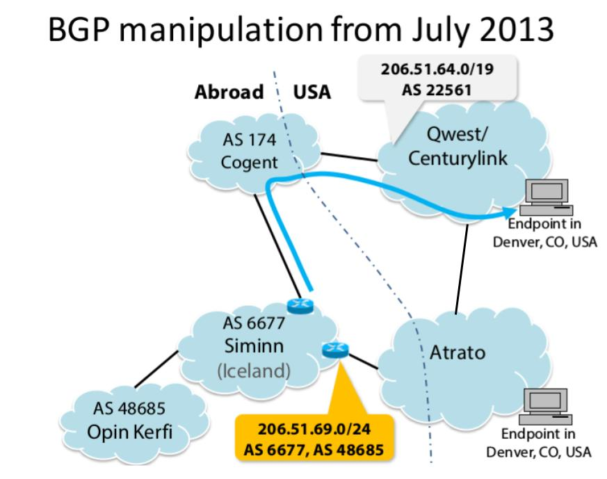
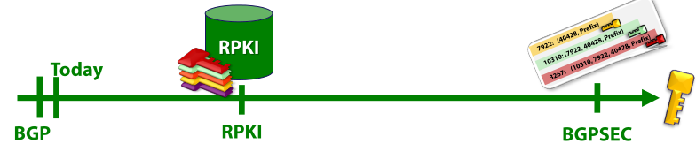

#Security of BGP

BGP is **B**order **G**ateway **P**rotocol. It is used to exchange routing information. It is mainly used in routers and gateways. It allows connection between large networks.

If one can manipulate BGP protocol well enough, then user-data can be routed in different ways. Routing may cause traffic to leave the US. Then, US laws are applied in a different way for traffic outside of the US.

The BGP manipulation which happened in July 13, data get routed from Denver to Iceland, although two endpoints were in Denver only. This is possibly because of the BGP manipulation. 

Renesys, an internet routing monitoring firm, found that some data from Denver could have travelled to NYC, London, Montreal and then back to Denver.

Let's look at the July '13 manipulation closely.

Here, the endpoint in Atrato network wanted to send some data over the internet to some endpoint in Qwest/Centurylink network. The endpoint in Atrato and the endpoint in Qwest had connection to transfer data directly. However, as explained in the picture, the data travelled through a network named Siminn in Iceland. This happened because of BGP manipulation.

In BGP, a router can announce which IP addresses fall into their control and network. Each of the network have an ID associated with it. For example, in the picture, Siminn network's ID is AS 6677. BU's ID is AS 111. BU was one of the earlier to adopt internet. Hence, they got a pretty small ID number, 111.

A router generally announce the IPs fall into their control by providing a list of  a range of continuous IP addresses. These IP addresses are expressed through the form of IP prefix. For example, AS 22561 in the above picture is announcing it by 206.51.64.0/19 . The IP range would be any IP whose first 19 bits are the same as the 206.51.64.0 . Rest (32 - 19) = 13 bits can change. Therefore total 2^13^ number of IPs fall into that range.

By following BGP announcement, a network can channel a packet destined for some network. The networks need to follow other network's BGP announcements. By following the announcements, a packet can find it path to reach the destination IP address. However, the problem is that anyone can announce BGP.

###What happened in July '13?
Please follow the above picture. The Siminn network (AS 6677) announced that it could route the packet to the destination IP address from Atrato, for those IPs which follow under 206.51.69.0/24 . This is a subset of the IP addresses which fall under the network of Qwsest (AS 22561). Beceause of BGP's particular design of choosing more specific range over less specific ones, Atrato chose Siminn to route the packets for the destination IPs in the range of 206.51.69.0/24 . It is important to note that 206.51.69.0/24 is more specific than 206.51.69.0/19 because the earlier is a subset of the former one.

It is also important to realize that Siminn only broadcasted its 206.51.69.0/24 subset of addresses to be under its control only to Atrato. Not to Cogent (AS 174). Otherwise, Cogent would have also sent all the packets destined for 206.51.69.0/24 ranged of IP addresses to Siminn. Then, Siminn could have converted into a **blackhole**. Because, it could have not found any route to those range of IP addresses, but all those packets destined for 206.51.69.0/24 range of IP addresses would come to Siminn.

Till now, nobody knows who actually carried out this and what the motive was. Renesys discovered this. They monitor this kind of traffic and report when something strage is noticed.

###How can we prevent this kind of manipulation/attack?

We have to secure routing. 

If we look at the above picture, left is less secure, and the ideal would be to go to the right. **R**esource **P**ublic **K**ey **I**nfrastracture (RPKI) is kind of a middleground.

It is very expensive in terms of timing cost to do cryptographic computation on routers. Therefore, the idea is to do computation outside and then deploy. We can use crypto signatures in BGP announcements. It is important to remember that Public Key crypto is slower than symmetric key crypto. Therefore, it's hard to do Public Key crypto on routers which have limited computing capabilities.

There are five authorities which issue IP addresses in different parts of the world. They issue certificates to the networks under them. This is not the same certificates as given for individual websites by the CAs which have been discussed previously. Till now, RPKI is deployed in 6% of the Internet. BGPSec is the most secure protocol known. But it is far from getting standardized, let alone being deployed.

###How does RPKI work?
There is a Route Origin Authorisation (ROA) object is given to each network. Please refer to the slides by Prof. Goldberg for the pictures related to this. A ROA object looks like the following:
 
|-----206.51.64.0/19-----|
|----------AS 22561--------|

This just says that the range 206.51.64.0/19 belongs to AS 22561. Now, whenever a network tries to route some data, it checks the announcement of a neighbouring network to match with the ROA from RPKI system. Any address which falls into the address block with a correct ROA, then those network is announcing valid range. With this kind of arrangement and system, the previous attack goes away.

####How can the previous attack come back?
**Foreign-origin attack:**
Anyone can forge to be someone else. Then, the previous attack can still be carried out.

Also, there might be some other parameters involved in chosing the right network. For example, in the first picture above, AS 6677 might allow open peering. Therefore, AS 6677 allows anyone to use its network for data-transfer. On the contrary, AS 22561 and Atrato might have a business relationship among them. AS 22561 might charge some dollars to Atrato to transfer data. To avoid extra cost, Atrato might choose to deliver through AS 6677. Cost might decide a forge path which AS 6677 may claim to have.

###Why is Digital Signature needed?

Digital Signature can ensure every path is signed. We can also use MAC to verify. However, MAC is very costly. In TLSm there's handshake in TCP. Then, keys are established and exchange starts. But in BGP, there's not so much time for doing all these. There may need to be n^2^ keys needed. All of these can make routing very slow.

##BGPSec
BGPSec is secure. Every network has a key here.
Let's go back to the very first picture. AS 22561 signs the following with its key:
**AS 174: (AS 22561, *prefix*)**

prefix is any range of IP address that AS 22561 wants to announce as its IP address range.
Then, AS 174 signs the following with its own key:

**AS 174: (AS 22561, *prefix*)
AS 6677: (AS 174, AS 22561, *prefix*)
**

Now if AS 6677 wants to intercept from Atrato it needs the following:
**AS 6677 : (AS 22561, *prefix*)**

However, Siminn or AS 6677 doesn't have that. Therefore, it cannot intercept. AS 22561 will also send the following to Atrato, signed by its own key:
**Atrato : (AS 22561, *prefix*)**

*Atrato* will not be written above actually, Some AS number will be written.

It is important to note that the verification happens in multiple layers in all the network. For example, AS 174 verifies whatever it gets from its neighbour such as AS 22561.

####Limitation
BGPSec cannot prevent **collusion attack**. In this type of attack, two networks consult and manipulate network traffic. For example, AS 22561 can sign with its own key for the traffic to be transferred through AS 6677. Then, AS 6677 will be able to intercept traffic from Atrato.

####Overheads
Matching the public keys is a very big overhead in this protocol. Routers also need to have all the public keys stored into the system. Many levels of verification of signature are also needed. Therefore, this is very costly. This protocol is far from standardized. Prof. Goldberg has almost no hope of it being deployed any time soon.

### How can we still carry out the previous attack of July '13?
Well, let's say, one fine morning, we decide to deploy BGPSec. However, not all network would be ready to deploy BGPSec. So, BGP and BGPSec would have to exist in parallel in the world. Then, one can carry out **downgrade attack**.

A router may speak BGPSec to one neighbour network and BGP to another neighbour network. In the above example picture, Siminn might decide to still carry forward BGP. Qwest may have upgraded to BGPSec. Now, when Atrato tries to route and have to choose between Siminn and Qwest, it has two options:
1) Secure (through Qwest)
2) Cheap (through Siminn)

It has been widely surveyed and reported that most of the networks will choose the cheapest route in most cases. Prof. Goldberg has personally investigated as well. Most network does choose the cheapest route. Therefore, the previous attack might still work.

*All Image Credit*: Prof. Goldberg's slides
